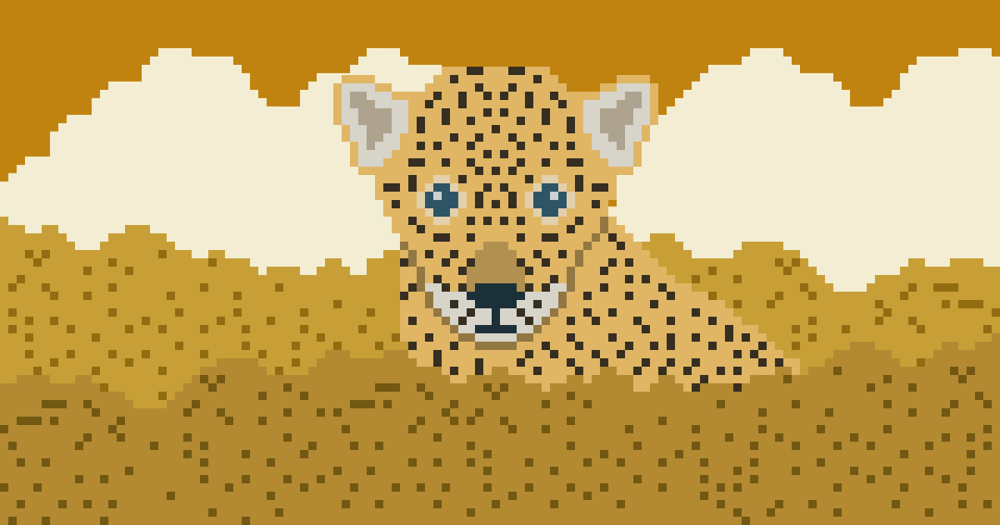
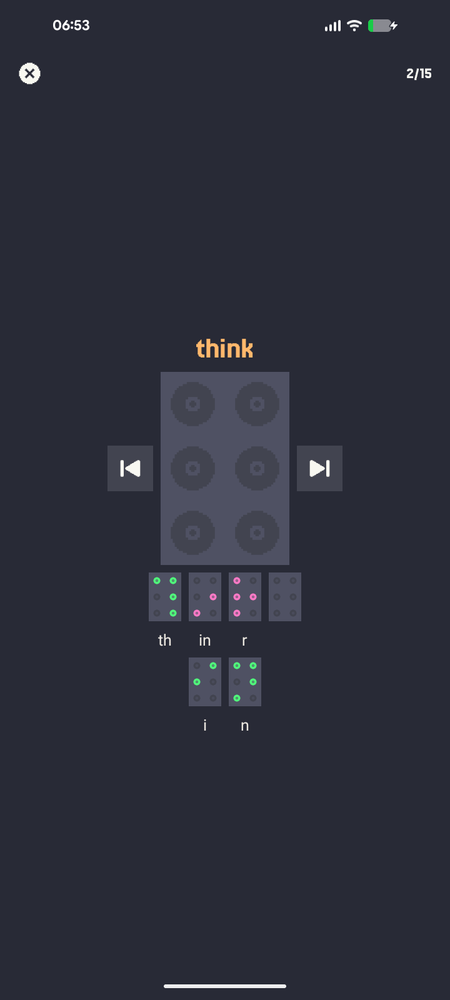
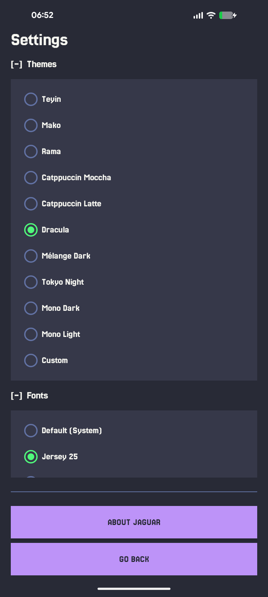
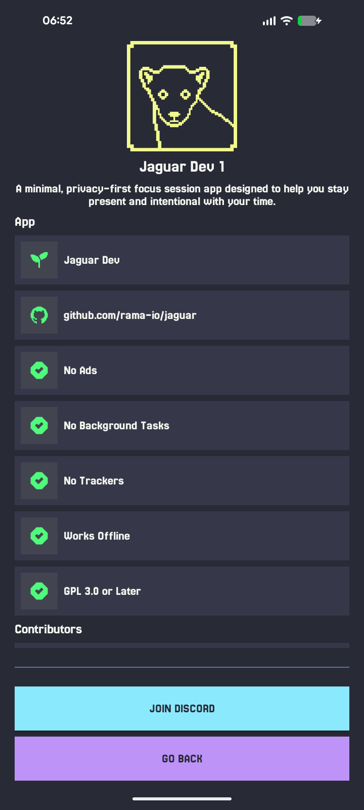

# Jaguar

**Jaguar** is an Android app for practicing braille by touch-typing it. Instead of reading braille, you build it: each round shows you a word and you enter its braille cells one at a time on a 6-dot input, cell by cell, until the whole word is spelled out correctly.

---

## Screenshots

| Stage | Settings | About |
| - | - | - |
|  |  |  |

---

## Installation

  
  <!-- &nbsp;
   -->
  &nbsp;
  

---

## License

**Jaguar** is Free Software. You are free to use, study, share, and improve it under the terms of the
**GNU General Public License v3** or later.

## Documents

- [Branding](./docs/branding.md)
- [Attributions](./docs/attributions.md)
